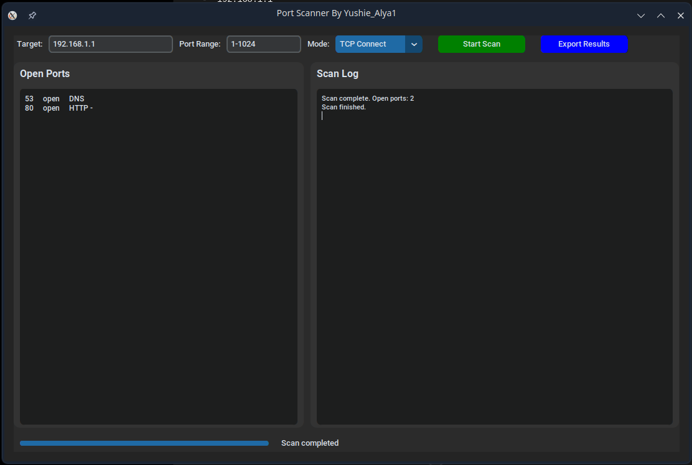

# Port Scanner

A modern, multi-threaded TCP port scanner with a dark-mode GUI, service detection, and export functionality. Built with Python and CustomTkinter.


---

## Overview

Port Scanner allows you to quickly scan a target host (IP address or domain name) for open TCP ports.

The application includes:

- Fast multi-threaded scanning
- Service detection for common ports
- Real-time progress updates
- Export functionality for scan results
- A modern dark-mode graphical interface

**Developed by:** Yushie_Alya1

---

## Features

- 🔍 **Target Any Host** – Scan IP addresses or domain names with automatic DNS resolution
- 📡 **Custom Port Ranges** – Scan ranges such as `1-1024`, `20-80`, or a single port
- 🚦 **Two Scan Modes**
  - TCP Connect Scan (currently available)
  - SYN Scan (planned for future implementation)
- 🛠️ **Service Banner Grabbing** – Attempts to retrieve banners from common services such as HTTP, SSH, and FTP
- 📊 **Real-Time Output** – Open ports appear immediately during scanning
- 💾 **Export Results** – Save scan results to TXT or CSV format
- 🎨 **Modern GUI** – Responsive dark-mode interface built with CustomTkinter

---

## Requirements

### System Packages (Linux)

```bash
sudo apt update
sudo apt install python3-tk
```

---

### Python Packages

Create a virtual environment and install dependencies:

```bash
python3 -m venv venv
source venv/bin/activate     # Linux/macOS

# Windows
venv\Scripts\activate

pip install customtkinter
```

> **Note:**  
> `scapy` is listed in `requirements.txt` for future SYN scan support, but it is not required in the current version.

---

## Installation & Usage

### 1. Clone the Repository

```bash
git clone https://github.com/YOUR_USERNAME/port-scanner.git
cd port-scanner
```

---

### 2. Create a Virtual Environment

```bash
python3 -m venv venv
```

---

### 3. Activate the Environment

#### Linux/macOS

```bash
source venv/bin/activate
```

#### Windows

```bash
venv\Scripts\activate
```

---

### 4. Install Dependencies

```bash
pip install customtkinter
```

---

### 5. Run the Application

```bash
python main.py
```

> No root privileges are required for TCP Connect scans.

---

## How to Use

1. Enter a target IP address or domain name  
   Example:
   - `scanme.nmap.org`
   - `192.168.1.1`

2. Specify a port range  
   Example:
   - `1-1024`
   - `20-80`

3. Click **Start Scan**

4. Monitor open ports in real time through the results panel

5. Export the scan results using **Export Results**

---

## Screenshot

```markdown

```

Example project structure:

```text
port-scanner/
├── screenshots/
│   └── main-window.png
```

---

## Legal Disclaimer

This tool is intended strictly for educational purposes and authorized security testing only.

You must obtain explicit permission from the system owner before scanning any host. Unauthorized port scanning may violate laws, regulations, or network policies.

The developer assumes no responsibility or liability for misuse of this software.

---

## Project Structure

```text
port-scanner/
├── main.py
├── core/
│   ├── scanner.py             # Port scanning logic
│   └── service_detection.py   # Service detection and port mapping
├── utils/
│   └── (reserved for future utilities)
├── requirements.txt
└── README.md
```

---

## Future Improvements

- Add SYN scanning support using Scapy
- Implement thread pooling for faster scans
- Add preset scan ranges (Common Ports, Full Range, etc.)
- Include ping sweep and host discovery
- Add configurable timeout and retry settings

---

## Contributing

Issues and pull requests are welcome.

For major changes, please open an issue first to discuss your proposed modifications.

---

## License

This project is licensed under the **MIT License**.  
See the `LICENSE` file for more information.

---

## Author

**Yushie_Alya1**

GitHub: `@YushieAlya1`